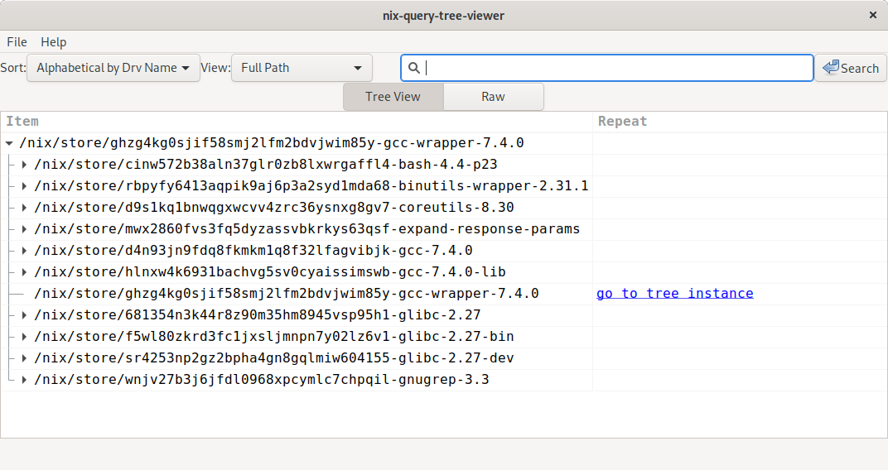
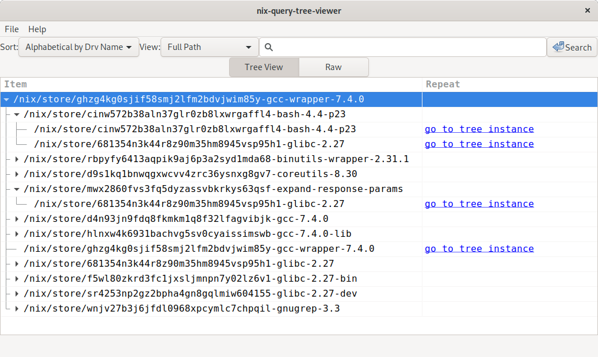

# nix-query-tree-viewer

[](https://github.com/cdepillabout/nix-query-tree-viewer/actions)
[](https://crates.io/crates/nix-query-tree-viewer)
[](https://deps.rs/repo/github/cdepillabout/nix-query-tree-viewer)


`nix-query-tree-viewer` is a convenient way to visualize the output of
the dependencies of a given path in the Nix store.



This is the same tree information that `nix-store --query --tree <PATH>` outputs,
but `nix-query-tree-viewer` makes it easier to understand and interact with.

## Usage

You can run `nix-query-tree-viewer` by passing it a path in the Nix store:

```console
$ nix-query-tree-viewer /nix/store/ghzg4kg0sjif58smj2lfm2bdvjwim85y-gcc-wrapper-7.4.0
```

## Installing

`nix-query-tree-viewer` can be installed with either Nix or Cargo.

Installing with `nix-env`:

```console
$ nix-env -f channel:nixos-unstable -iA hello
```

This is convenient if you just want to use `nix-query-tree-viewer`.

Installing with `cargo`:

```console
$ cargo install nix-query-tree-viewer
```

You'll need to have GTK libraries available in your environment for this to work.

## Why use `nix-query-tree-viewer`?

The command `nix-store --query --tree` can be used to see the dependencies of a
path in the Nix store in a tree format:

```console
$ nix-store --query --tree /nix/store/ghzg4kg0sjif58smj2lfm2bdvjwim85y-gcc-wrapper-7.4.0
/nix/store/ghzg4kg0sjif58smj2lfm2bdvjwim85y-gcc-wrapper-7.4.0
+---/nix/store/681354n3k44r8z90m35hm8945vsp95h1-glibc-2.27
|   +---/nix/store/681354n3k44r8z90m35hm8945vsp95h1-glibc-2.27 [...]
+---/nix/store/cinw572b38aln37glr0zb8lxwrgaffl4-bash-4.4-p23
|   +---/nix/store/681354n3k44r8z90m35hm8945vsp95h1-glibc-2.27 [...]
|   +---/nix/store/cinw572b38aln37glr0zb8lxwrgaffl4-bash-4.4-p23 [...]
+---/nix/store/hlnxw4k6931bachvg5sv0cyaissimswb-gcc-7.4.0-lib
|   +---/nix/store/681354n3k44r8z90m35hm8945vsp95h1-glibc-2.27 [...]
|   +---/nix/store/hlnxw4k6931bachvg5sv0cyaissimswb-gcc-7.4.0-lib [...]
+---/nix/store/f5wl80zkrd3fc1jxsljmnpn7y02lz6v1-glibc-2.27-bin
|   +---/nix/store/681354n3k44r8z90m35hm8945vsp95h1-glibc-2.27 [...]
...
```

This is fine for simple derivations, but it gets very complicated for paths
with deep dependency trees.

`nix-query-tree-viewer` helps with this by folding branches of the tree by
default.  Clicking on a branch allows you to drill down into interesting
branches.

For example, here is the same picture as above, but with two of the branches
open:



## Finding Paths for Derivations

You can use `nix-build` and `nix-instantiate` to easily find the paths for
derivations.

For instance, if you want to find the path of `gcc` in the Nix store, you can
use `nix-build`:

```console
$ nix-build '<nixpkgs>' -A gcc --no-out-link
...
/nix/store/ghzg4kg0sjif58smj2lfm2bdvjwim85y-gcc-wrapper-7.4.0
```

If you want to find the path of the `.drv` file for `gcc`, you can use
`nix-instantiate`:

```console
$ nix-instantiate '<nixpkgs>' -A gcc
...
/nix/store/dyxdjxyszmlz29mb0jr9qkncj5l41dai-gcc-wrapper-7.4.0.drv
```

You should be able to pass both
`/nix/store/ghzg4kg0sjif58smj2lfm2bdvjwim85y-gcc-wrapper-7.4.0` and
`/nix/store/dyxdjxyszmlz29mb0jr9qkncj5l41dai-gcc-wrapper-7.4.0.drv` to `nix-query-tree-viewer`.

In general, passing the output of `nix-build` to `nix-query-tree-viewer` will
let you see the run-time dependencies of a derivation, while passing the output
of `nix-instantiate` will let you see the build-time dependencies of a
derivation.

## Contributions

Feel free to open an issue or PR for any
bugs/problems/suggestions/improvements.
